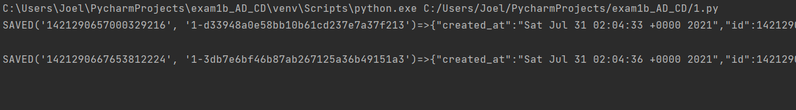
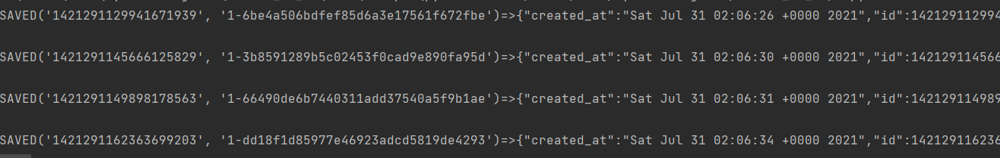
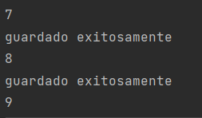

# EPN

## Examen primer bimestre de Analisis de Datos

**Carlos Diaz**

Implementar los scripts necesarios de acuerdo a la arquitectura propuesta.

Crear un repositorio de github donde se implemente mediante scripts de python cada numeral de la arquitectura de ingesta de datos. Los scripts deben llamarse “n.py” donde “n” es el # de script correspondiente. El readme del repositorio debe ser explicativo, es decir en sus palabras deben indicar cada script o proceso de forma general.

Subir el link de github al aula virtual. NO puede hacer cambios en el repositorio posterior a la hora límite.

Cualquier similitud en los comentarios del código serán considerados copia.

1. Implementamos tweepy para obtener informacion sobre ciudades de Japon donde se desarrollan los juegos olimpicos, esto se almacena en CouchDB

2. Implementamos tweepy para obtener informacion sobre las palabras 'juegos olimpicos', 'Tokio 2020' para obtener informacion acerca de los juegos olimpicos, esto se almacena en CouchDB

3. Implementamos un web scraper que permite obtener informacion en la pagina del comercion acerca de los juegos olimpicos, se lamacena en MongoDB de forma local

4. Implementamos facebook scraper para tomar informacion de la pagina olympics de la cual nos retorno informacion sobre las ultimas publicaciones esto se guardo en MongoDB de manera local

 Para tiktok-scraper es necesario ejecutar los comandos:
  
   - Iniciará el scraper mediante npm
   
   **npm i -g tiktok-scraper**
  
  - Hecho esto basta ejecutar el comando con los parametros siguientes para que nos genere un CSV:

  Usuario 1: **tiktok-scraper user stamkkk -t csv**
  
   

  Usuario 2: **tiktok-scraper user dannapaola -t csv**
  
  
  
  Para importar el CSV a MySQL verificamos los pasos:
  
  

   
  
  

  Comprobamos que la BD se haya insertar de manera correcta (por la extensión de la misma, solo se adjuntan capturas que comprueben el hecho)
  
  

  

  

  ###### Mismo proceso para el otro usuario:
  
  

  

  

  Comprobamos:
  
  

  

  

## 6) MySQL => MongoDB

  Para migrar de MySQL a MongoDB es ncesario exportar las BD de MySQL
  
  

  - Al hacer esto se generará un JSON
  
  

  - En MongoDB Compass creamos la BD tiktok y la colección para la primera BD (dannapaola)
  
  

  - Importamos el archivo JSON generados anteriormente:
  
  

  

  - Comprobamos que la importación se realizó con exito:
  
  

  

  **Repetimos los mismos pasos para la otra BD (stamkkk):**
  
  

  

  

  

  

  

## 3) Web Scrapping
   
  Se importan las librerías necesarias, en este caso Pymongo:
  
  
   
   Se definen las funciones que serviran para la busqueda:
   
   

  Con la ayuda de BeatifulSoup se filtra y además se crean los contenedores:
  
  
  
  Finalmente se limpia el código HTML por ultima vez y se conecta con el cliente de MongoDB para guardar los datos:
  
  

  Se crea la BD en MongoDB Compass correctamente:
  
  

  - Se ha creado la colección:
  
  

  - Se presenta cada objeto nuevo de la colección:

  

